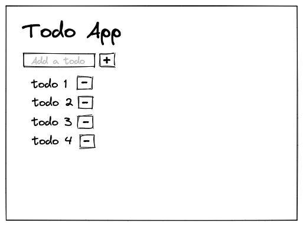

# WA React Bootcamp 22Q2: Fundamentals

This coding challenge will help you practice everything we saw in the lecture. You are going to build a todo app.

## Requirements

- "Home" page that includes:
  - Title for app's name.
  - Form that includes an input and an button for adding a new todo.
- "Todo" component that renders the todo and a delete button.
- Props validation for "Todo" component.

## Design

The app should look like:

Don't worry about styles, you will have a complete session for it.
